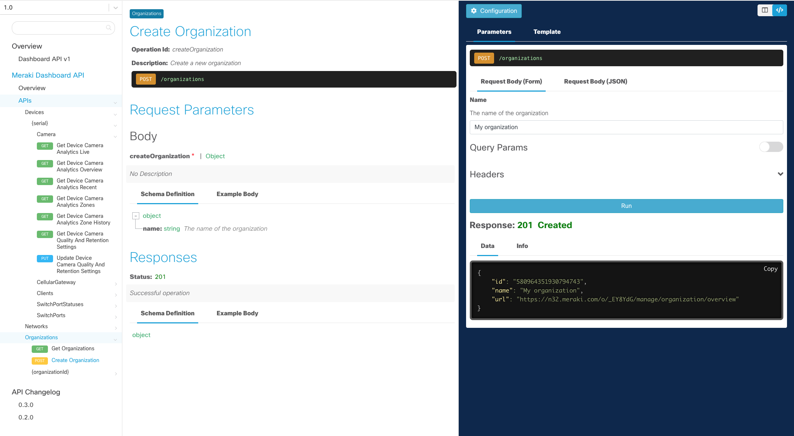

# XYZ API

_> This is the overview page for your OpenAPI document. If the backend is setup, developers will be able to make GET requests in the docs and get real responses. Use the template below for interactive documents. Use this page to help them navigate the UI so that they can successfully make requests. If the backend is not setup, you will need to modify the sample text._

_> Provide a 2-3 sentence introduction to the purpose of the interactive doc._ _Meraki Example:_

Use the interactive documentation to explore the Meraki API.

Each request will have a complete description of all the required parameters and also allow you to instantly try it out in the online console. Code Templates are also provided for quickly building scripts in Curl, Python, and Node.js.

## How to use the API docs

A demo API key is provided by default and will allow you to make read-only API requests. All you have to do is click `Run`.

The interactive document uses read-only credentials and the try it out feature will only work with GET requests. To make additional requests you can create your own API credentials and use the tool of your choice (e.g. cURL, Postman, Python).

_> If a Postman Collection is available, link them to your Postman Collection page under Developer Resources._

_> If Sandboxes are available, point them to the Sandbox page under Developer Resources._

Examples:
- [Cisco XDR Automation API](https://developer.cisco.com/docs/cisco-xdr/#!automation-api-guide) (interactive)
- [Cisco Umbrella Networks API](https://developer.cisco.com/docs/cloud-security/#!api-reference-deployments-networks-overview/overview) (static)
